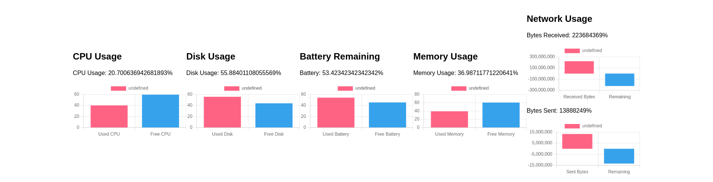

# systrack

## Simple angular application that collects frequently system use data from a go/gin API.



## Application builded with : 

   
    


<hr>

### Requirements: Docker and Docker compose installed locally.

### How to run (recommendation) : 
### At the root directory of the project :
#### To create and launch the application virtually using Docker containers:

```
docker compose build
docker compose up
```
#### You should find the AngularJS application at :
[http://localhost:4200/](http://localhost:4200/)

#### To stop the containers and networks :

```
docker compose build
```

#### You may also look at the logs of the go/gin program in your terminal. 


